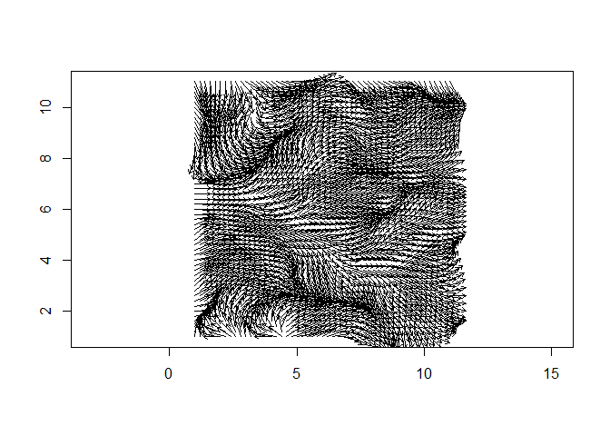

<!-- README.md is generated from README.Rmd. Please edit that file -->

# CircSpatial

<!-- badges: start -->
<!-- badges: end -->

`CircSpatial` provides functions for spatial analysis of circular data.

## Installation

You can install the development version of `CircSpatial` from
[GitHub](https://github.com/) with:

``` r
# install.packages("devtools")
devtools::install_github("tobiste/CircSpatial")
#> Downloading GitHub repo tobiste/CircSpatial@HEAD
#> sp        (2.0-0 -> 2.1-4) [CRAN]
#> dotCall64 (1.1-0 -> 1.1-1) [CRAN]
#> maps      (3.4.1 -> 3.4.2) [CRAN]
#> Installing 3 packages: sp, dotCall64, maps
#> Installing packages into 'C:/Users/tstephan/AppData/Local/Temp/Rtmpo9FgWs/temp_libpath48a06940517f'
#> (as 'lib' is unspecified)
#> package 'sp' successfully unpacked and MD5 sums checked
#> package 'dotCall64' successfully unpacked and MD5 sums checked
#> package 'maps' successfully unpacked and MD5 sums checked
#> 
#> The downloaded binary packages are in
#>  C:\Users\tstephan\AppData\Local\Temp\RtmpUvhPDo\downloaded_packages
#> ── R CMD build ─────────────────────────────────────────────────────────────────
#>          checking for file 'C:\Users\tstephan\AppData\Local\Temp\RtmpUvhPDo\remotes17286bb1d4e\tobiste-CircSpatial-e732f5b/DESCRIPTION' ...  ✔  checking for file 'C:\Users\tstephan\AppData\Local\Temp\RtmpUvhPDo\remotes17286bb1d4e\tobiste-CircSpatial-e732f5b/DESCRIPTION'
#>       ─  preparing 'CircSpatial': (420ms)
#>    checking DESCRIPTION meta-information ...     checking DESCRIPTION meta-information ...   ✔  checking DESCRIPTION meta-information
#>   Warning:     Warning: bad markup (extra space?) at OceanWind.Rd:9:91
#>       ─  checking for LF line-endings in source and make files and shell scripts
#>       ─  checking for empty or unneeded directories
#>       ─  building 'CircSpatial_1.0.1.9000.tar.gz'
#>      
#> 
#> Installing package into 'C:/Users/tstephan/AppData/Local/Temp/Rtmpo9FgWs/temp_libpath48a06940517f'
#> (as 'lib' is unspecified)
```

## Example

This is a basic example which shows kriging interpolation.

### Simulate a circular random field

``` r
library(CircSpatial)

xy <- expand.grid(1:11, 1:11) # grid
x1 <- xy[, 1]
y1 <- xy[, 2]
model.direction1 <- matrix(data = c(
  157, 141, 126, 113, 101, 90, 79, 67, 54, 40, 25, 152, 137, 123, 111, 100, 90, 80, 69, 57, 44, 30,
  147, 133, 120, 109, 99, 90, 81, 71, 60, 48, 35, 142, 129, 117, 107, 98, 90, 82, 73, 63, 52, 40,
  137, 125, 114, 105, 97, 90, 83, 75, 66, 56, 45, 132, 121, 111, 103, 96, 90, 84, 77, 69, 60, 50,
  127, 117, 108, 101, 95, 90, 85, 79, 72, 64, 55, 122, 113, 105, 99, 94, 90, 86, 81, 75, 68, 60,
  117, 109, 102, 97, 93, 90, 87, 83, 78, 72, 65, 112, 105, 99, 95, 92, 90, 88, 85, 81, 76, 70,
  107, 101, 96, 93, 91, 90, 89, 87, 84, 80, 75
), ncol = 11, byrow = TRUE)
model.direction1 <- as.vector(model.direction1) * pi / 180

## Compute vM CRF of 121 observations, Rho=sqrt(0.5) so sill about 0.5,
## from GRF (Range=4, spherical covariance).
set.seed(666)
crf1 <- SimulateCRF(
  CircDistr = "vM", Rho = sqrt(0.5), Range = 4, CovModel = "spherical",
  Grid = xy, OverFit = TRUE
)
```

### Compute rotational residuals from the mean direction

``` r
# Make sample
sample.direction1 <- model.direction1 + crf1$direction

## Fit An Appropriate Model
## Code for median polish is contained in Appendix K, Section K.12
FitHoriz1 <- lm(cos(sample.direction1) ~ (x1 + y1))
FitVert1 <- lm(sin(sample.direction1) ~ (x1 + y1))
fitted.direction1 <- atan2(FitVert1$fitted.values, FitHoriz1$fitted.values)

## Compute Residuals
resids1 <- CircResidual(
  X = x1, Y = y1, Raw = sample.direction1, Trend = fitted.direction1,
  Plot = FALSE
)
```

### Circular kriging

``` r
## Kriging locations 
x2 <- seq(1, 11, by = 0.2)
y2 <- x2

KrigCRF(
  krig.x = x2, krig.y = y2, resid.x = resids1$x, resid.y = resids1$y,
  resid.direction = resids1$direction, Model = RandomFields::RMexp(), Nugget = 0.0, Range = 4, sill = 0.56,
  Plot = TRUE
)
```


